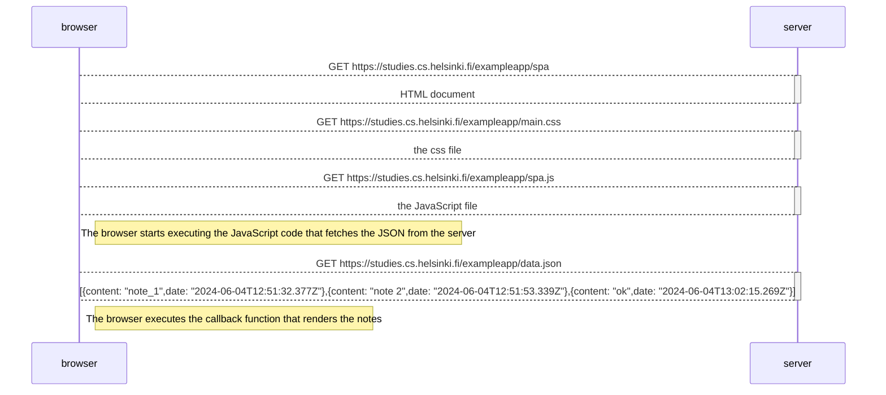

```mermaid
sequenceDiagram
  participant browser
  participant server

  browser-->server: GET https://studies.cs.helsinki.fi/exampleapp/spa
  activate server
  server-->browser: HTML document
  deactivate server

  browser-->server: GET https://studies.cs.helsinki.fi/exampleapp/main.css
  activate server
  server-->browser: the css file
  deactivate server

  browser-->server: GET https://studies.cs.helsinki.fi/exampleapp/spa.js
  activate server
  server-->browser: the JavaScript file
  deactivate server

  Note right of browser: The browser starts executing the JavaScript code that fetches the JSON from the server

  browser-->server: GET https://studies.cs.helsinki.fi/exampleapp/data.json
  activate server
  server-->browser: [{content: "note_1",date: "2024-06-04T12:51:32.377Z"},{content: "note 2",date: "2024-06-04T12:51:53.339Z"},{content: "ok",date: "2024-06-04T13:02:15.269Z"}]
  deactivate server

  Note right of browser: The browser executes the callback function that renders the notes


```
