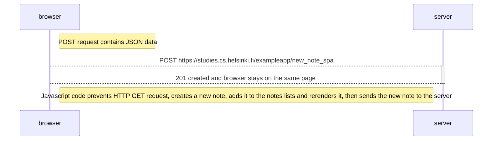

```mermaid

sequenceDiagram
  participant browser
  participant server

  Note right of browser: POST request contains JSON data

  browser-->server: POST https://studies.cs.helsinki.fi/exampleapp/new_note_spa
  activate server
  server-->browser: 201 created and browser stays on the same page
  deactivate server

  Note right of browser: Javascript code prevents HTTP GET request, creates a new note, adds it to the notes lists and rerenders it, then sends the new note to the server

```
